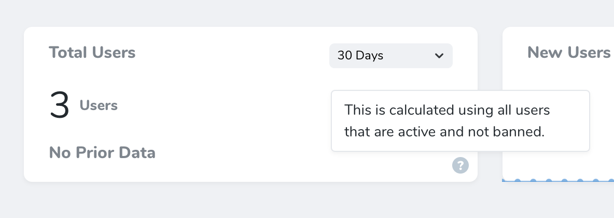

# Registering Metrics

Once you have defined a metric, you are ready to attach it to a resource. Each resource generated by Nova contains a `cards` method. To attach a metric to a resource, you should simply add it to the array of metrics / cards returned by this method:

```php
/**
 * Get the cards available for the resource.
 *
 * @param  \Illuminate\Http\Request  $request
 * @return array
 */
public function cards(Request $request)
{
    return [new Metrics\UsersPerDay];
}
```

## Resource Detail Metrics

In addition to placing metrics on the resource index page, you may also attach a metric to the resource detail page. For example, if you are building a podcasting application, you may wish to display the total number of podcasts created by users over time. To instruct a metric to be displayed on the detail page instead of the index page, chain the `onlyOnDetail` method onto your metric registration:

```php
/**
 * Get the cards available for the request.
 *
 * @param  \Illuminate\Http\Request  $request
 * @return array
 */
public function cards(Request $request)
{
    return [
        (new Metrics\PodcastCount)->onlyOnDetail(),
    ];
}
```

You will need to modify your metric's query to only gather metric data on the resource for which it is currently being displayed. To accomplish this, your metric's `calculate` method may access the `resourceId` property on the incoming `$request`:

```php
use App\Podcast;

return $this->count($request, Podcast::where('user_id', $request->resourceId));
```

## Dashboard Metrics

You are not limited to displaying metrics on a resource's index page. You are free to add metrics to your primary Nova "dashboard", which is the default page that Nova displays after login. By default, this page displays some helpful links to the Nova documentation via the built-in `Help` card. To add a metric to your dashboard, add the metric to the array of cards returned by the `cards` method of your `app/Providers/NovaServiceProvider` class:

```php
use App\Nova\Metrics\NewUsers;

/**
 * Get the cards that should be displayed on the Nova dashboard.
 *
 * @return array
 */
protected function cards()
{
    return [
        new NewUsers,
    ];
}
```

## Metric Sizes

By default, metrics take up one-third of the Nova content area. However, you are free to make them larger. To accomplish this, call the `width` method when registering the metric with a resource:

```php
/**
 * Get the cards available for the request.
 *
 * @param  \Illuminate\Http\Request  $request
 * @return array
 */
public function cards(Request $request)
{
    return [
        // Two-thirds of the content area...
        (new Metrics\UsersPerDay)->width('2/3'),

        // Full width...
        (new Metrics\UsersPerDay)->width('full'),
    ];
}
```

## Metric Help / Tooltips

Sometimes a metric needs to offer the user more context about how the value is calculated or other details related to it. To provide this context, Nova allows you to define a help text "tooltip", which can be registered similarly to [Field Help Text](/2.0/resources/fields.html#field-help-text):



To enable the tooltip, simply call `help` on the metric instance and pass in your desired text:

```php
/**
 * Get the cards available for the request.
 *
 * @param  \Illuminate\Http\Request  $request
 * @return array
 */
public function cards(Request $request)
{
    return [
        (new TotalUsers)
            ->help('This is calculated using all users that are active and not banned.'),
    ];
}
```

You may also use HTML when defining your help text:

```php
(new TotalUsers)
    ->help(view('nova.metrics.total-users.tooltip')->render()),
```

## Authorization

If you would like to only expose a given metric to certain users, you may chain the `canSee` method onto your metric registration. The `canSee` method accepts a Closure which should return `true` or `false`. The Closure will receive the incoming HTTP request:

```php
use App\User;

/**
 * Get the cards available for the resource.
 *
 * @param  \Illuminate\Http\Request  $request
 * @return array
 */
public function cards(Request $request)
{
    return [
        (new Metrics\UsersPerDay)->canSee(function ($request) {
            return $request->user()->can('viewUsersPerDay', User::class);
        }),
    ];
}
```

In the example above, we are using Laravel's `Authorizable` trait's `can` method on our `User` model to determine if the authorized user is authorized for the `viewUsersPerDay` action. However, since proxying to authorization policy methods is a common use-case for `canSee`, you may use the `canSeeWhen` method to achieve the same behavior. The `canSeeWhen` method has the same method signature as the `Illuminate\Foundation\Auth\Access\Authorizable` trait's `can` method:

```php
use App\User;

/**
 * Get the cards available for the resource.
 *
 * @param  \Illuminate\Http\Request  $request
 * @return array
 */
public function cards(Request $request)
{
    return [
        (new Metrics\UsersPerDay)->canSeeWhen(
            'viewUsersPerDay', User::class
        ),
    ];
}
```
